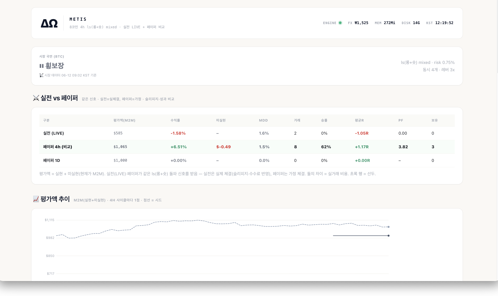

# METIS — 암호화폐 무기한 선물 자동매매 시스템

 

Bybit USDT-M 무기한 선물 거래를 자동화하는 시스템. **현재 운영 중인 현행 시스템**이며, v1부터 이어진 전면 재설계의 진화 기록(v1~v3 + 이후 실험 분기 v4~v7)을 함께 보존한다.

> **현행 운영 버전은 `v6/` 이다.** v7은 이후 실험 분기이고 v6만큼 정리되어 있지 않다
> (원자적 SL 미적용, 대시보드 메모리 최적화 미반영). 코드를 읽으신다면 **`v6/code/README.md`부터** 보시면 된다.

각 버전은 직전 버전의 한계를 데이터로 확인한 뒤 전면 재설계한 결과다.

- 직감보다 데이터 — 거래 표본을 쌓고, 통계로 결정하고, 결과를 그대로 기록
- **판단 주체는 세대마다 바뀌었고, 한 번에 걷어낸 것이 아니다.**

  | 버전 | 판단 경로의 LLM |
  |---|---|
  | v1~v3 | **AI = 판단자**(방향·강도·진입 자리), 코드 = 실행자(SL·TP·청산·안전 검증) |
  | v4 | 라이브 봇은 규칙 기반. LLM 은 일일 리포트·회의 보조로만 남음(`daily_report.py`, `gpt_meeting.py`) |
  | v5 | **다시 Gemini Flash 스캘핑**으로 회귀 (`v5/code/config/settings.py:123`) |
  | v6 | **LLM 완전 제거.** 규칙 기반 4h 다중코인 돌파 엔진 |
  | v7 | **다시 LLM 을 판단·recheck 경로에 넣은 실험 분기** (`v7/code/ai/gemini_client.py`) |

  페이퍼·실전 병행 검증에서 **AI 판단이 규칙 기반보다 낫다는 근거가 나오지 않아** v6에서 완전히 뺐다.
  v7은 그 결론을 한 번 더 시험해 본 분기이고, v6만큼 정리되어 있지 않다.
  AI를 쓰는 것이 목적이 아니라 문제를 푸는 것이 목적이므로, 데이터가 우위를 보여주지 못하면 빼는 편이 맞다고 판단했다.

## 운영 대시보드 (LIVE)



현재 운영 중인 실험 분기의 모니터링 대시보드(Streamlit). 핵심은 **실전 vs 페이퍼 병행 검증** —
같은 신호를 실전 계좌(실체결, 슬리피지·수수료 반영)와 페이퍼(가정 체결)에 동시에 흘려보내고
두 결과의 차이로 **실거래 비용을 정량 측정**한다. 시장 국면 판독, 수익률·MDD·승률·평균R·PF,
4H 사이클 단위 평가액 추이를 한 화면에서 확인.

> **스크린샷의 숫자를 그대로 읽어 주시길 바란다.** 촬영 시점 실전 평가액은 $585, 수익률 −1.58%,
> 승률 0% 다. 이 저장소는 **수익을 낸 시스템이 아니라 검증 과정을 남긴 기록**이다.
> 계좌 규모도 작다 — 검증 목적이라 크게 넣지 않았다.
> `v3/trades_v2.csv` 에 실체결 9건이 그대로 들어 있고 합계는 −$1.65 다.

## 버전별 요약

| 버전 | 심볼 | 주요 특징 | 결과 |
|---|---|---|---|
| **v1** | BTC | AI 진입 판단 + 코드 SL/TP. 멀티 타임프레임 (1H/4H/1D) | 운영 안정화, 무기한 선물 첫 적용 |
| **v2** | BTC, XRP | AI Full Delegation (방향/레버리지/SL/TP 모두 AI 결정). Recheck + Profit Guard. 페이퍼 모드 도입 | 9거래 표본으로 통계 한계 인정, 폐기 |
| **v3** | ETH, SOL, XRP | 단타(15분~2시간) 전환. Gemini Flash. 3심볼 완전 병렬 + 점수 비교 진입. 자체 트레일링 스탑 | v1~v3 계열의 마지막. 이후 v4 로 전면 재설계 |

## 버전별 핵심 변화

### v1 — 기반 구축

단일 심볼(BTC) + 1H 주력, 4H/1D 컨텍스트. AI가 진입을 판단하면 코드가 SL/TP를 설정하는 기본 구조를 확립했다. 한계: 순차 처리, 진입 후 재평가(Recheck) 없음.

### v2 — AI 권한 확대와 안전망

- **AI Full Delegation**: 방향·레버리지·SL/TP를 모두 AI가 결정하고, 코드는 안전 검증만 수행
- **Recheck 시스템**: 보유 포지션을 주기적으로 재평가 (HOLD / MODIFY / EXIT)
- **Profit Guard**: 멀티 타임프레임 반전 + 피크 드로다운 + 하드 드로다운의 3중 트리거
- 모든 사이클의 시장 데이터와 AI 결정을 JSON으로 기록 (사후 분석용)
- 폐기 결정 자체가 학습이었다: 9거래는 통계적 판단 근거가 되지 못하고, 누적 패치는 사이드 이펙트 추적을 어렵게 한다 → 깨끗한 출발점을 위해 폐기

### v3 — 단타 전환과 병렬화

운영 데이터 분석에서 나온 발견을 반영해 전면 재설계했다.

- **Recheck 편향 수정**: 12회 연속 HOLD 현상 분석 → 프롬프트가 EXIT 옵션을 실질적으로 차단하고 있었음을 발견, "지금이라면 진입할 것인가"를 강제로 묻는 구조로 재작성
- **진입 프롬프트 재작성** (리서치 기반): Classic/Hidden Divergence 구분, 진입 거부 조건 4종, 자기 합리화형 reasoning("리스크는 있으나 보완 가능") 차단 — 손실 거래의 공통 패턴이었음
- **자체 트레일링 스탑** (`core/trailing_stop.py`): 피크 +0.6% 도달 시 활성화, 0.3%p 후퇴 시 SL 자동 이동, 30초 폴링
- **완전 병렬 분석**: 3심볼 × LONG/SHORT를 ThreadPoolExecutor로 동시 분석, 분석 시간 65초 → 29초 (55% 단축). 점수 비교로 승자 1개만 진입
- 모델을 Gemini Pro → Flash로 교체해 응답 속도 4~10배, 비용 40% 절감

## 데이터에서 나온 발견 (운영 표본 기준)

- ATR < 1.5 구간 진입은 전패, ATR ≥ 2 구간은 승률 우위 → 변동성 필터의 근거
- BTC에서 AI가 반대 방향으로 진입하는 경향 → v3에서 BTC 제외
- 단타에서 수수료 비중이 커짐 (5x 레버리지 시 왕복 0.55%) → 레버리지 3x 권장
- 손실 거래의 공통점은 "리스크를 인정하면서 보완 논리로 진입"하는 reasoning → 프롬프트 차원에서 차단

## 폴더 구조

```
METIS/
├── v1/                 # 기반 구조 — AI 진입 판단 + 코드 SL/TP
├── v2/                 # AI Full Delegation + 안전망 (9거래 표본으로 폐기)
├── v3/                 # 단타 + 3심볼 병렬화. v1~v3 계열의 마지막
├── v4/                 # 전면 재설계. 라이브 봇 규칙 기반, LLM 은 리포트·회의 보조
├── v5/                 # Gemini Flash 스캘핑으로 회귀
├── v6/                 # ★ 현행 — 규칙 기반 4h 다중코인 돌파 엔진, LLM 없음
└── v7/                 # LLM 판단을 재시험한 분기. 정리 덜 됨
```

각 버전 폴더에 해당 버전의 README가 있다. 읽으신다면 **`v6/code/README.md` 부터** 보시면 된다.

⚠️ `v5/README.md` 의 제목이 "METIS v4 — Production Setup" 으로 되어 있다(내부 넘버링 어긋남).

## Risk Warning

연구 등급 시스템이며 금융 자문이 아닙니다. 암호화폐 무기한 선물은 고위험 레버리지 상품입니다. 페이퍼 모드로 충분히 검증한 뒤 잃어도 되는 자본만 사용하세요.
